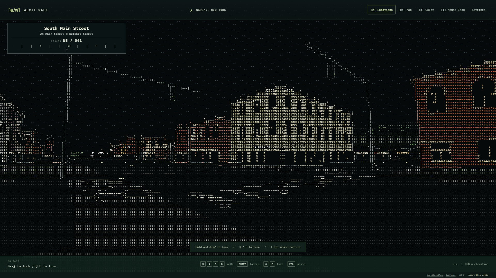
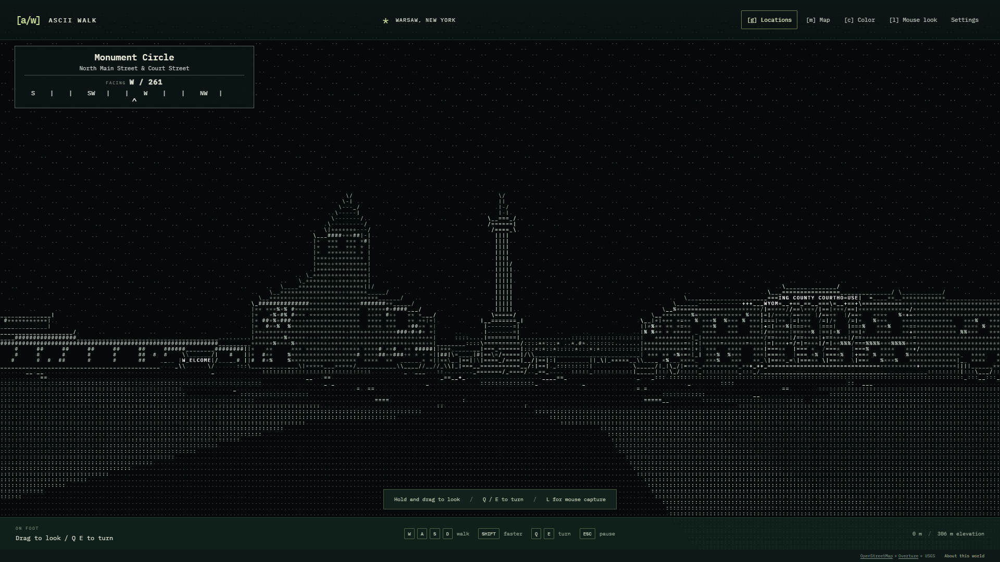
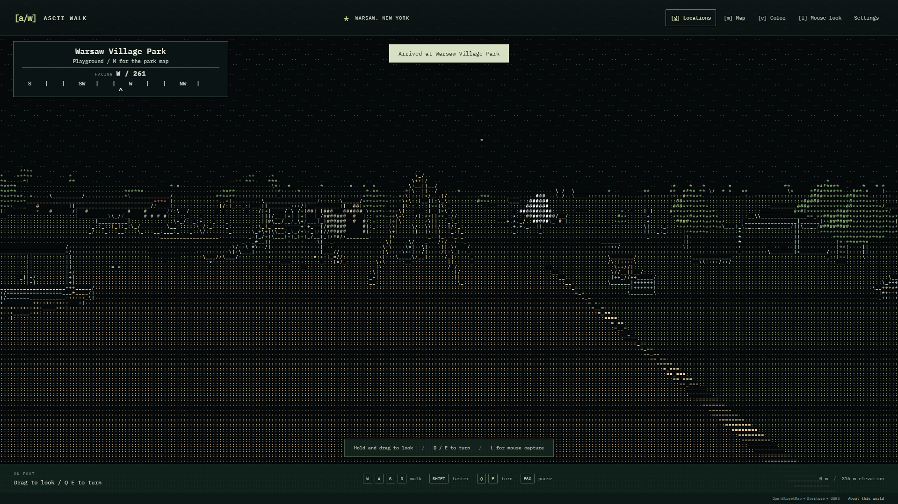

# ASCII Walk

**A place you know. A world of characters.**

Explore Warsaw, New York on foot in a world drawn entirely with ASCII characters. Real streets, building footprints, and rolling terrain provide the geography. Authored landmarks, storefronts, playgrounds, people, and traffic bring it to life.

**[Play in your browser](https://mgelsinger.github.io/asciiwalk/)** · [Download the source](https://github.com/mgelsinger/asciiwalk/archive/refs/heads/main.zip) · [Report a problem](https://github.com/mgelsinger/asciiwalk/issues)



## Try it in a minute

1. Open the **[browser demo](https://mgelsinger.github.io/asciiwalk/)** on a desktop or laptop. Nothing to install, no account, and no API key.
2. Choose **Pick a starting location**. Try the monument, courthouse, downtown shops, school, shopping center, movie theater, or park.
3. Use **WASD** to walk and **Q / E** to turn, or hold the left mouse button and drag. Press **G** to jump somewhere else and **C** to try monochrome.

The demo includes Warsaw and prepared examples of Perry and downtown Buffalo. **Choose another town** switches between them. Preparing a new neighborhood requires the local app and optional Python setup below.

Use a keyboard, mouse or trackpad, and a browser with **WebGL2** and hardware acceleration. Chrome, Edge, and Brave have been tested on Windows. Touch controls are not implemented. Other browsers and graphics hardware may behave differently.

## What to explore

- **Recognizable streets:** real road alignment and building footprints, street names, a compass, and an ASCII neighborhood map.
- **Warsaw landmarks:** the Soldiers' and Sailors' Monument, courthouse, Main/Buffalo shops, library, churches, and post office.
- **Places with detail:** school entrances and athletic grounds, the Spotlight Theater marquee, shopping-center carts and parking, and downtown street furniture.
- **A living park:** basketball and tennis courts, swings, a merry-go-round, slides, pools, ball fields, picnic tables, and moving players.
- **Your preferred view:** colored ASCII or monochrome, character size, contrast, field of view, sensitivity, and a **Still** activity setting. Reduced-motion preferences start the world still.

Your position, selected starting point, and preferences are saved in your browser. Buildings and water block walking; roads follow the terrain. There are no photographs or image textures in the normal world view. The menus are ordinary browser UI; the world itself is drawn with printable ASCII glyphs.

<details>
<summary>See the monument in monochrome and the park</summary>





Screenshots from the application. Geographic data credits are listed below.

</details>

## Run on your computer

Install **[Node.js](https://nodejs.org/) 22.12 or newer** with npm on Windows, macOS, or Linux. Node 22 is used by the automated checks. Python is **not** needed to explore the included worlds.

### Get the files

Use **Code > Download ZIP** on GitHub and extract the whole folder, or clone it:

```sh
git clone https://github.com/mgelsinger/asciiwalk.git
cd asciiwalk
```

If you downloaded the ZIP, open a terminal in the extracted folder containing `package.json`. Then run:

```sh
npm ci
npm start
```

`npm ci` installs the locked dependencies and needs internet access. `npm start` starts the local app in the background, waits for it to be ready, and opens **your default web browser** at [127.0.0.1:5173](http://127.0.0.1:5173/). Subsequent starts reuse the running app. The prepared worlds and font are local, so walking works without internet once installation is complete.

On **Windows**, after `npm ci`, double-click **Launch ASCII Walk.cmd** whenever you want to play. Run `npm run shortcuts` once to add **ASCII Walk** and **Stop ASCII Walk** shortcuts to your desktop. They point to this folder, so rerun that command if you move it.

On **macOS or Linux**, use `npm start`. Linux needs a desktop browser and `xdg-open` for automatic opening; you can always open the displayed address yourself.

### Stop or update

Closing the browser leaves the local server running. Stop it with:

```sh
npm stop
```

Windows also has **Stop ASCII Walk.cmd**. For updates, stop the app, pull the latest source or download a fresh ZIP, run `npm ci`, and launch again. Keep your old `public/worlds/` imports if you want to retain places you prepared yourself.

**Do not open `index.html` directly.** This app needs an HTTP server to load its modules, fonts, and world files. Use the browser demo, the launcher, or `npm start`.

## Controls

| Control                           | Action                                                           |
| --------------------------------- | ---------------------------------------------------------------- |
| **W A S D**                       | Walk forward, left, back, right                                  |
| **Q / E**                         | Turn left / right                                                |
| **Hold left mouse button + drag** | Look around                                                      |
| **Arrow keys**                    | Turn left/right or walk forward/back                             |
| **Shift**                         | Walk faster                                                      |
| **L**                             | Capture the mouse for continuous looking                         |
| **Escape**                        | Release the mouse and pause                                      |
| **G** or **Locations**            | Jump to a Warsaw destination                                     |
| **M**                             | Show the neighborhood map                                        |
| **C**                             | Toggle color / monochrome                                        |
| **F** or the nearby prompt        | Interact with equipment or read a local note                     |
| **R**                             | Return to the selected location's starting point                 |
| **Settings**                      | Change character size, sensitivity, contrast, view, and activity |

Menus pause walking. The compass uses north at **000**, east at **090**, south at **180**, and west at **270**. Mouse capture is optional; Q/E and drag-to-look are enough to explore.

## Prepare another town (optional)

Install **[Python 3.11](https://www.python.org/downloads/)**, then run this once in the project folder:

```sh
npm run setup
```

Setup creates a local `.venv` and installs pinned geography dependencies. Python 3.11 is the tested version; newer versions depend on compatible GIS packages. If Python is in a custom location, set `ASCII_PYTHON` to its executable path before setup.

Start with `npm start`, choose **Choose another town**, and search for a US town or enter coordinates. Select a **1, 2, or 4 km square**, preview the streets, and choose **Prepare this place**. Preparation needs internet access to OpenStreetMap and USGS. Progress and cancellation are built in; finished worlds are saved locally and can be revisited without downloads.

The terrain provider currently covers the **contiguous United States**. New places get generated building detail; Warsaw has additional authored architecture and furnishings. Public data services can time out or rate-limit requests. Failed preparation leaves the current world intact.

## Develop and test

The app uses **TypeScript, Three.js, and Vite**. Node runs a local preparation API; Python handles optional GIS processing. The renderer converts a 3D scene into printable ASCII on the GPU. Read the [architecture notes](docs/ARCHITECTURE.md) for the scene, terrain, navigation, and animation systems.

```sh
npm ci
npm run dev
```

Development runs in the foreground at [127.0.0.1:5173](http://127.0.0.1:5173/). Stop any background launcher first with `npm stop`. Use **Ctrl+C** to stop development.

| Command                   | Purpose                                                      |
| ------------------------- | ------------------------------------------------------------ |
| `npm start` / `npm stop`  | Open or stop the background local app                        |
| `npm run shortcuts`       | Create Windows desktop shortcuts                             |
| `npm run check`           | TypeScript and formatting checks                             |
| `npm test`                | Geometry, collision, navigation, recreation, and API tests   |
| `npm run validate:assets` | Check bundled worlds, terrain, checksums, and required files |
| `npm run build`           | Validate and build the standalone viewer into `dist/`        |
| `npm run preview`         | Preview the standalone build at port 4173                    |
| `npm run test:geo`        | Geography tests, after Python setup                          |
| `npm run data:warsaw`     | Rebuild Warsaw from shipped source snapshots and overrides   |

For browser tests, leave `npm run dev` running in a separate terminal:

```sh
npx playwright install chromium
npm run test:e2e -- --project=chromium
```

Longer recording, visual-reference, and live-import tests are opt-in. See [validation instructions](docs/VALIDATION.md). CI checks a clean installation on Windows, macOS, and Linux and tests the production viewer under a repository subdirectory before publishing it.

### Hosting the viewer

`npm run build` produces a self-contained static site with the three worlds, font, and credits. Serve the **contents of `dist/`** over HTTP or HTTPS. Asset paths are relative, so the viewer works at a domain root or in a subdirectory. No Node or Python service is needed on a static host.

The included [GitHub Pages workflow](.github/workflows/pages.yml) builds, tests, and publishes the demo when `main` changes. Forks build and test without deploying to this project's site. To publish a fork, enable Pages with **GitHub Actions** in repository settings and change the deployment condition to your repository name. See [Vite's deployment guide](https://vite.dev/guide/static-deploy) for other static hosts.

New-area preparation is available only in the local app. The local servers bind to `127.0.0.1`, using ports **5173** and **5174**. They are not configured as a public import service.

## What is included

| Folder            | Contents                                                      |
| ----------------- | ------------------------------------------------------------- |
| `src/`            | Renderer, world geometry, walking, UI, and activity           |
| `public/worlds/`  | Three ready-to-play, machine-readable world packs             |
| `public/`         | Data credits, font license, reference list, and launcher icon |
| `server/`         | Local API and server lifecycle                                |
| `tools/`          | Launchers, asset validation, and geography preparation        |
| `data/overrides/` | Warsaw architectural observations and estimates               |
| `research/`       | Bounded source snapshots, source metadata, and research notes |
| `tests/`          | Unit, geography, and browser checks                           |
| `docs/`           | Architecture, place/source notes, and selected screenshots    |

Dependencies, Python environments, caches, logs, local launcher tokens, generated imports, builds, and test recordings are ignored by Git. Warsaw's numeric terrain and bounded height source snapshots are intentionally included for reproducibility. Original reference photographs are not distributed. See [data and reproducibility](docs/DATA.md).

## Troubleshooting

| Symptom                                        | Try this                                                                                                                     |
| ---------------------------------------------- | ---------------------------------------------------------------------------------------------------------------------------- |
| Broken page after opening HTML                 | Use the demo link or `npm start`; do not open the HTML file directly.                                                        |
| `node` or `npm` is not found                   | Install Node.js, reopen your terminal, and check `node --version`.                                                           |
| PowerShell says `npm.ps1` cannot run           | Use `npm.cmd ci` and `npm.cmd start`, or use Command Prompt. No execution-policy change is needed.                           |
| Missing dependencies                           | Run `npm ci` from the folder with `package.json`. Extract the ZIP first.                                                     |
| Browser does not open                          | Open [127.0.0.1:5173](http://127.0.0.1:5173/) manually. Logs are in `.launcher/server.log`.                                  |
| Port 5173 or 5174 is occupied                  | Run `npm stop`, or stop the previous development terminal with Ctrl+C. Close an unrelated program on those ports separately. |
| Blank world, graphics error, or slow rendering | Enable hardware acceleration, update the browser, and try **Coarse** character size in Settings.                             |
| Difficult to steer                             | Try WASD + Q/E, or drag the view. Press Escape to release captured mouse input.                                              |
| New-place preparation unavailable              | Use the local app and run `npm run setup`. The hosted demo only opens prepared worlds.                                       |
| Provider timeout                               | Keep exploring a saved world and retry later. Cached source downloads are reused.                                            |

When [reporting a problem](https://github.com/mgelsinger/asciiwalk/issues), include your operating system, browser/version, whether you used the demo or local app, the place you selected, what you expected, and steps to reproduce. A screenshot helps with recognition and rendering issues.

## Geography, credits, and limits

This is an explorable interpretation, not a surveyed reconstruction or live street view. Footprints and street alignments are sourced; facade details, many heights, equipment layouts, vegetation, pedestrians, and traffic include estimates. Some architectural references date from 2009 to 2020. There are no interiors, driving, multiplayer, touch controls, or international terrain adapters in this version.

Map data: **OpenStreetMap contributors** and applicable **Overture Maps / Microsoft ML Buildings** sources. Elevation: **USGS 3DEP**. Place-name index: **GeoNames**. Font: **IBM Plex Mono**. The adapted geographic database, application code, and font have distinct licensing terms. Keep the [data notices](public/DATA_LICENSES.txt), [font license](public/FONT_LICENSE.txt), and [third-party software notices](public/THIRD_PARTY_NOTICES.txt) with distributions.

An application-code reuse license has not yet been selected. The source is published for inspection and project testing; the data and third-party licenses above remain applicable independently.

More detail: [destinations](docs/LOCATIONS.md) · [park](docs/PARK.md) · [site details](docs/DESTINATION_DETAILS.md) · [recognition and estimates](docs/RECOGNITION.md) · [validation](docs/VALIDATION.md).
